# Architecture Visual

```mermaid
flowchart TD
    subgraph Current["Current working stack"]
        P[Prompt] --> LS[llama.cpp / llama-server]
        LS --> GGUF[Target GGUF model]
        LS --> FA[FlashAttention / HIP attention path]
        LS --> TQ[TurboQuant KV compression]
        GGUF --> DEC[Normal decoding]
        FA --> DEC
        TQ --> DEC
        DEC --> OUT[Output tokens]
    end

    subgraph ExistingSpec["Existing llama.cpp speculative path"]
        P2[Prompt] --> LS2[llama.cpp / llama-server]
        LS2 --> TARGET[Target model]
        LS2 --> DRAFT[Normal draft model]
        DRAFT --> DRAFTTOK[Draft tokens]
        TARGET --> VERIFY[Target verifies draft tokens]
        DRAFTTOK --> VERIFY
        VERIFY --> OUT2[Output tokens]
    end

    subgraph FutureDFlash["Future DFlash-style path"]
        P3[Prompt] --> LS3[llama.cpp / llama-server with DFlash support]
        LS3 --> TARGET2[Target GGUF model + FA + TurboQuant]
        LS3 --> DFLASH[DFlash draft model]
        DFLASH --> BLOCK[Block draft tokens]
        TARGET2 --> VERIFY2[Target verifies block]
        BLOCK --> VERIFY2
        VERIFY2 -->|accepted| FAST[Emit multiple tokens]
        VERIFY2 -->|rejected| FALLBACK[Fallback to target sampling]
        FAST --> OUT3[Output tokens]
        FALLBACK --> OUT3
    end
```

## Mental model

- **TurboQuant** optimizes the KV cache.
- **FlashAttention** optimizes attention math.
- **DFlash** changes the decoding loop by using a second draft model.
- The target model remains the final authority.
